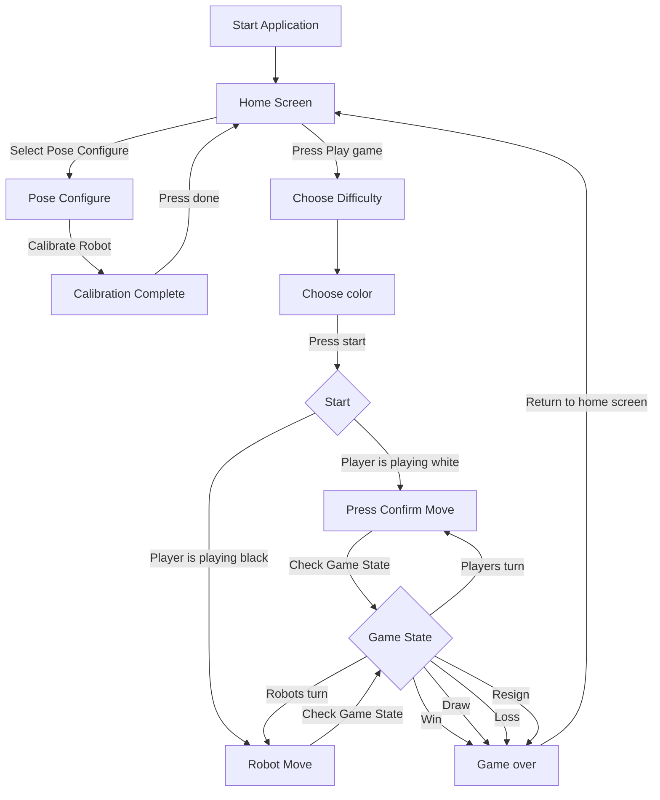
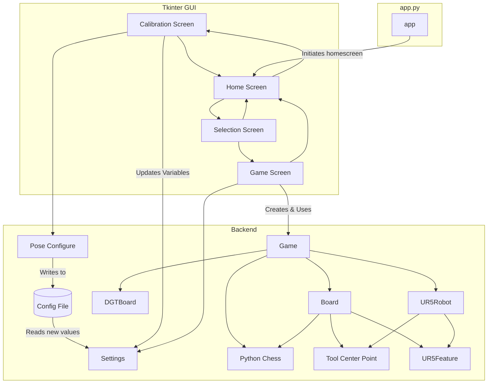
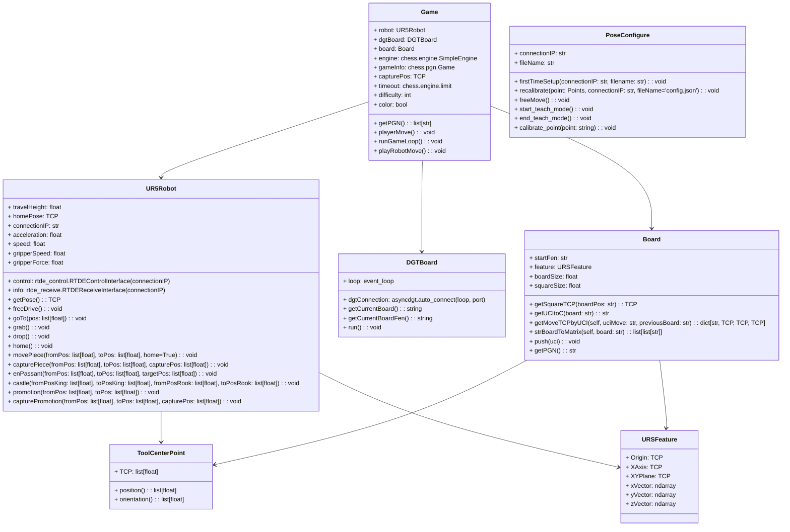

# UR5ChessbotRemake


## Introduction
The HVL Robotics Chess Robot is a student-developed project aimed at providing hands-on experience to students in automation and informatics. The project integrates various challenging tasks such as:

- Mapping the chessboard for accurate robot interaction
- Detecting changes on the board and responding appropriately
- Handling errors from the human opponent
- Integrating and using the Stockfish engine to determine strong chess moves
- Providing a user-friendly way to adjust settings from within the application
- Offering a graphical user interface (GUI) for calibration, difficulty and color selection, move confirmations, historical move review, and more

This robot has been showcased at HVL Robotics events to visitors, demonstrating the possibilities of combining robotics, software development, and AI-driven gameplay.

## Diagrams and charts
### Flowchart
The flowchart illustrates the user flow within the application, beginning at the home screen. It shows the steps a user can take, such as configuring the robot, setting up a game, and playing through different phases. Each stage of the game is represented, including move confirmation, turn logic, and game state transitions, culminating in a win, draw, or loss. This helps users and developers understand the application's sequential logic and user interactions.


### Domain diagram
The domain diagram provides an overview of the application's components and their relationships. It separates the system into three main parts:

1. Tkinter GUI: Includes screens like home, calibration, selection, and gameplay.

2. Backend: Contains the logic for robot control, chess operations, and configuration management.

3. app.py: Serves as the central controller, this is the file that is run calling creating an instanse of the gui

This diagram emphasizes modularity and how the application integrates diverse components into a cohesive workflow.





### UML diagram
This is a more detailed diagram of the backend going into detail about the differen classes within the program



## Current system capabilities
- [X] In app calibration of the robot
- [X] Select color and difficulty
- [X] Can do every type of move(Castling, en passant, capturing and normal moves)
- [X] Play a complete game of chess
- [X] View the movehistory of the current game
- [X] Resign a game
- [X] Win and lose

## Required Equipment
- **DGT Chessboard**: Ensures accurate piece detection and move validation. [View Product](https://digitalgametechnology.com/products/home-use-e-boards/usb-e-board-rosewood-in-gift-box)
- **UR5 Robot**: A robotic arm for physically moving the chess pieces. [View Product](https://www.universal-robots.com/no/produkter/ur5-robot/)
- **Touchscreen (Optional)**: Enhances user interaction and accessibility. [View Product](https://raspberrypi.dk/no/produkt/133-hdmi-touchscreen-display-med-case/?currency=NOK)
- **Computer**: Currently the main platform. (Testing on Raspberry Pi is planned for future iterations.)
- **Operating System**: Currently tested only on an Ubuntu Foxy virtual machine.[Read about it here](https://docs.ros.org/en/foxy/Installation/Ubuntu-Install-Debians.html)

## Changing settings
At the moment only configuration of the robot is possible to change from the GUI, the rest has to be manually changed in the Settings.py file.
Remember evaluate the safety of changes related to the robot, to high speeds could create danger for users, rule of thumb is to keep the robot moving under 250mm a second

## Installing Requirements
1. **Python Virtual Environment (Recommended)**  
   Activate the Python virtual environment:
   ```bash
   python3 -m venv venv
   source venv/bin/activate
2. **Install dependencies**
   ```bash
   pip install -r requirements.txt
3. **Install asyngdgt from github**
   ```bash
   pip install git+https://github.com/niklasf/python-asyncdgt

## Running application
1. **Activate viritual environment**
```bash
source venv/bin/activate
```
2. **Run the Application**
```bash
python3 app.py
```
## Future improvments
See issues!
