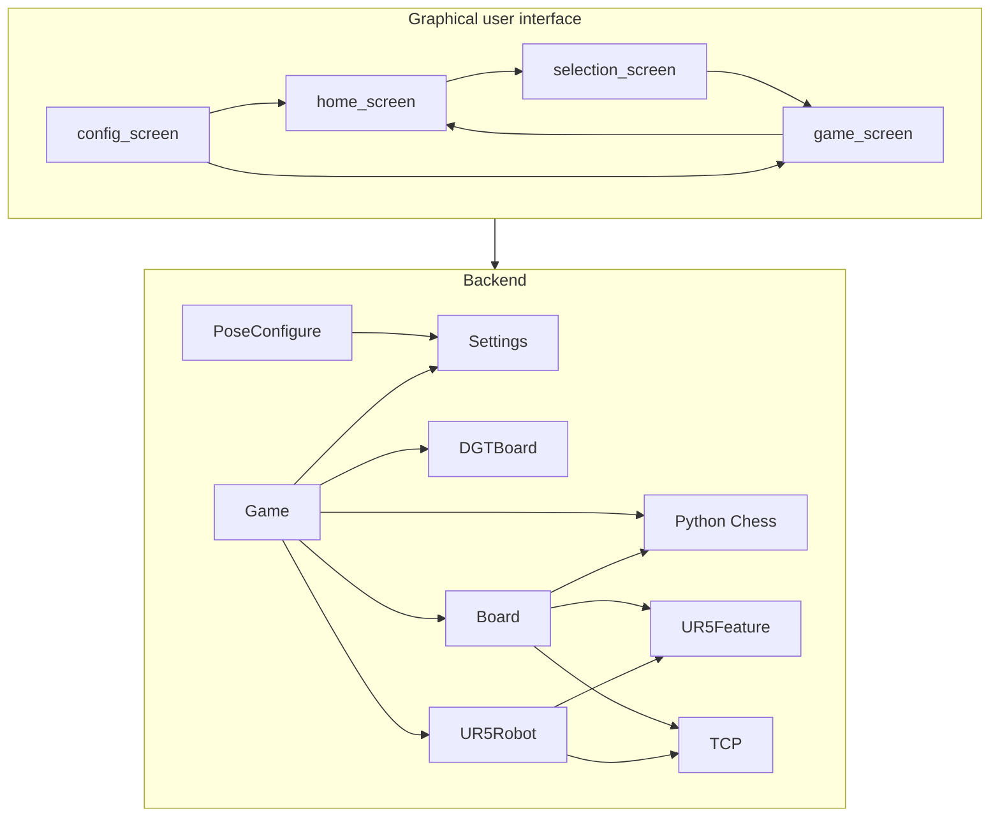
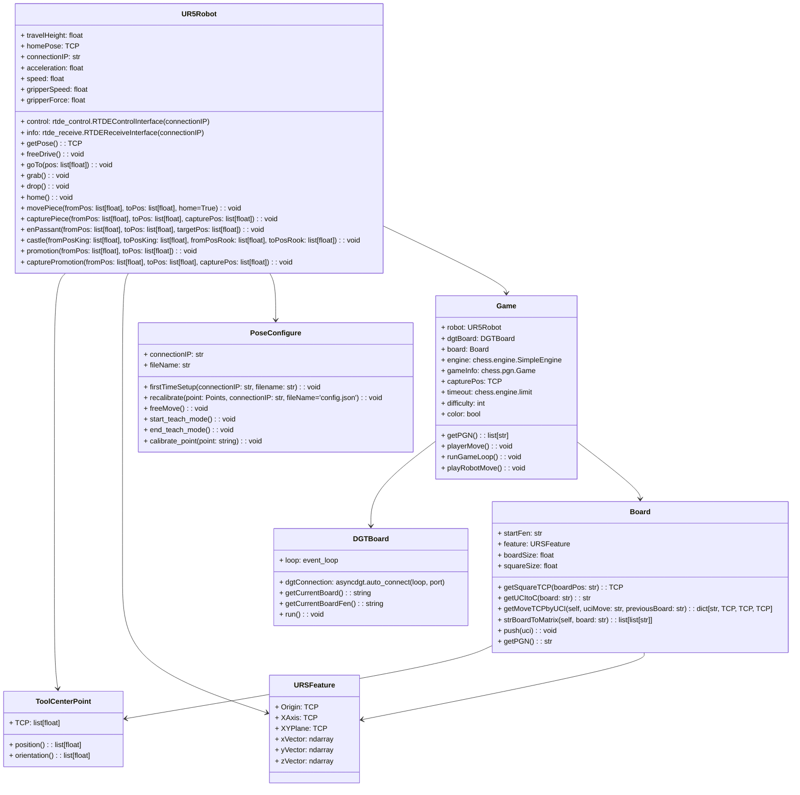

# UR5ChessbotRemake

    
## Introduction
The HVL Robotics Chess Robot is a student-developed project aimed at providing hands-on experience to students in automation and informatics. The project integrates various challenging tasks such as:

- Mapping the chessboard for accurate robot interaction
- Detecting changes on the board and responding appropriately
- Handling errors from the human opponent
- Integrating and using the Stockfish engine to determine strong chess moves
- Providing a user-friendly way to adjust settings from within the application
- Offering a graphical user interface (GUI) for calibration, difficulty and color selection, move confirmations, historical move review, and more

This robot has been showcased at HVL Robotics events to visitors, demonstrating the possibilities of combining robotics, dsoftware development, and AI-driven gameplay.
## Current Architecture diagrams

### Domain diagram
This is a domaindoagram giving an overview of the components within the program. 



### UML diagram
This is a more detailed diagram of the backend going into detail about the differen classesw within the program



## Current system capabilities
- [X] In app calibration of the robot
- [X] Select color and difficulty
- [X] Can do every type of move(Castling, en passant, capturing and normal moves)
- [X] Play a complete game of chess
- [X] View the movehistory of the current game
- [X] Resign a game
- [X] Win and lose

## Required Equipment
- **DGT Chessboard**: Ensures accurate piece detection and move validation. [View Product](https://digitalgametechnology.com/products/home-use-e-boards/usb-e-board-rosewood-in-gift-box)
- **UR5 Robot**: A robotic arm for physically moving the chess pieces. [View Product](https://www.universal-robots.com/no/produkter/ur5-robot/)
- **Touchscreen (Optional)**: Enhances user interaction and accessibility. [View Product](https://raspberrypi.dk/no/produkt/133-hdmi-touchscreen-display-med-case/?currency=NOK)
- **Computer**: Currently the main platform. (Testing on Raspberry Pi is planned for future iterations.)
- **Operating System**: Currently tested only on an Ubuntu Foxy virtual machine.


## Installing Requirements
1. **Python Virtual Environment (Recommended)**  
   Activate the Python virtual environment:
   ```bash
   python3 -m venv venv
   source venv/bin/activate
2. **Install dependencies**
   ```bash
   pip install -r requirements.txt
3. **Install asyngdgt from github**
   ```bash
   pip install git+https://github.com/niklasf/python-asyncdgt

## Running application
1. **Activate viritual environment**
```bash
source venv/bin/activate
```
2. **Run the Application**
```bash
python3 app.py
```
## Future improvments
- [ ] **Testing and optimizing performance on raspberry pi**
- [ ] **Handle threefoldrepetition**
- [ ] **Handle insufficient material**
- [ ] **Adding game review at the end of games**
- [ ] **Adding chessvariations like chess960**
